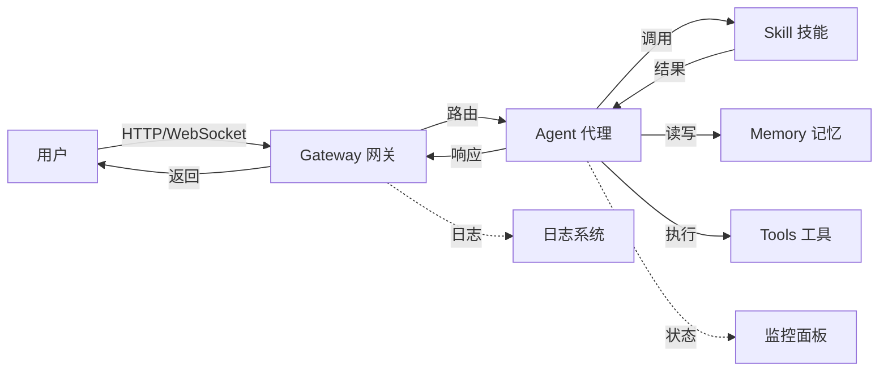

# 📘 OpenClaw 安装与首次使用教程

> **培训阶段**：第一阶段 - 安装与基础概念（1 天）
> **目标**：让团队成员能用 OpenClaw 构建生产级自动化工作流和 AI 代理系统
> **预计用时**：2-3 小时

---

## 📋 学习目标

完成本教程后，你将能够：
- ✅ 独立完成 OpenClaw 安装和配置
- ✅ 理解核心概念：Agent、Session、Skill、Cron、Team 的关系
- ✅ 配置模型并启动 Gateway
- ✅ 通过多种方式（Web/Dashboard/消息平台）访问
- ✅ 画出架构数据流图

---

## 🔧 前置条件

### 系统要求
- **操作系统**：macOS / Linux / Windows (WSL2)
- **Node.js**：v20+ (推荐使用 nvm 管理)
- **npm 或 pnpm**：包管理工具
- **内存**：至少 8GB RAM
- **磁盘空间**：至少 2GB 可用空间

### 必备账号
- 一个可用的模型 API Key（百炼/智谱/OpenAI 等）
- GitHub 账号（可选，用于 ClawHub 技能安装）

---

## 🚀 第一步：安装 OpenClaw

### 方式 A：使用 npm（推荐）

```bash
npm install -g openclaw
```

### 方式 B：使用 pnpm

```bash
pnpm add -g openclaw
```

### 方式 C：国内镜像加速

```bash
npm install -g openclaw --registry=https://registry.npmmirror.com
```

### 验证安装

```bash
openclaw --version
# 预期输出：x.x.x（版本号）
```

**💡 常见问题**：
- 如果提示权限错误，使用 `sudo npm install -g openclaw`
- 如果网络超时，配置淘宝镜像：`npm config set registry https://registry.npmmirror.com`

---

## 📂 第二步：理解目录结构

首次启动会自动创建配置目录：

```bash
openclaw
```

生成的目录结构：

```
~/.openclaw/
├── workspace/          ← 工作区（你的项目文件）
│   ├── SOUL.md         ← Agent 灵魂/性格定义
│   ├── IDENTITY.md     ← Agent 身份信息
│   └── USER.md         ← 用户信息
├── agents/             ← Agent 配置
│   └── main/           ← 主 Agent
│       └── agent/
│           └── models.json  ← 模型配置
├── skills/             ← 自定义技能
│   ├── user-level/     ← 用户级技能（全局可用）
│   └── project-level/  ← 项目级技能（项目内可用）
├── canvas/             ← 画板（可视化内容）
├── gateway/            ← 网关配置
│   └── gateway.log     ← 网关日志
└── teams/              ← 团队配置（多 Agent 协作）
```

**📝 核心概念**：

| 概念 | 说明 | 类比 |
|------|------|------|
| **Agent** | AI 代理，执行任务的核心单元 | 一个员工 |
| **Session** | 会话，一次对话或任务的上下文 | 一次会议 |
| **Skill** | 技能，扩展 Agent 能力的插件 | 员工的专业技能 |
| **Cron** | 定时任务，自动化工作流 | 定时闹钟 |
| **Team** | 团队，多 Agent 协作 | 项目组 |
| **Gateway** | 网关，对外服务接口 | 前台接待 |

---

## ⚙️ 第三步：配置模型

编辑 `~/.openclaw/agents/main/agent/models.json`：

```json
{
  "providers": {
    "my-provider": {
      "baseUrl": "https://dashscope.aliyuncs.com/compatible-mode/v1",
      "apiKey": "sk-xxx",
      "api": "openai-completions",
      "models": [
        {
          "id": "qwen-plus",
          "name": "Qwen Plus",
          "reasoning": true,
          "input": ["text"],
          "contextWindow": 128000,
          "maxTokens": 8192,
          "api": "openai-completions"
        }
      ]
    }
  }
}
```

**🔑 常用模型配置**：

| 模型 | base_url | 备注 |
|------|----------|------|
| 百炼 qwen | `https://dashscope.aliyuncs.com/compatible-mode/v1` | 国内推荐，稳定快速 |
| 智谱 glm | `https://open.bigmodel.cn/api/paas/v4/` | 国产模型，中文理解强 |
| OpenAI | `https://api.openai.com/v1` | 需要代理，性能最佳 |
| 本地 Ollama | `http://localhost:11434/v1` | 完全本地，数据隐私 |

**💡 配置技巧**：
- 可以配置多个 provider，实现故障转移
- `contextWindow` 越大，能处理的上下文越长
- `maxTokens` 限制单次响应最大长度

---

## 🌐 第四步：启动 Gateway

```bash
openclaw gateway start
```

启动成功后访问 Web Dashboard：
```
http://localhost:18789
```

**🔍 Gateway 的作用**：
```
用户请求 → Gateway → Agent → Skill 执行 → 响应返回
                ↓
            日志记录、权限检查、会话管理
```

**📊 架构数据流图**：



**💡 常用命令**：

```bash
# 启动 Gateway
openclaw gateway start

# 停止 Gateway
openclaw gateway stop

# 查看状态
openclaw gateway status

# 查看日志
tail -f ~/.openclaw/gateway/gateway.log

# 自定义端口
openclaw gateway start --port 18790
```

---

## 👤 第五步：配置身份文件

### 配置 Agent 性格（SOUL.md）

编辑 `~/.openclaw/workspace/SOUL.md`：

```markdown
# SOUL.md - Agent 的灵魂

## 核心特质
- **名字**: 小助手
- **性格**: 温暖、直接、有用
- **语言**: 中文优先
- **风格**: 简洁明了，不说废话

## 工作原则
1. 先理解需求，再动手实现
2. 遇到问题先尝试自己解决
3. 有不确定时主动询问
4. 记住用户的偏好和习惯

## 边界
- 不执行危险操作（删除系统文件等）
- 不泄露敏感信息
- 不在未确认时发送外部消息
```

### 配置用户信息（USER.md）

编辑 `~/.openclaw/workspace/USER.md`：

```markdown
# USER.md - 关于用户

## 基本信息
- **名字**: [你的名字]
- **称呼**: [希望被怎么称呼]
- **时区**: Asia/Shanghai
- **邮箱**: your@email.com

## 工作习惯
- 偏好简洁的回复
- 喜欢直接给出结果，不要过多解释
- 代码优先使用 Python/TypeScript

## 项目背景
- 主要工作：AI 辅助开发
- 技术栈：Node.js, Python, React
- 常用工具：VS Code, Terminal
```

### 配置 Agent 身份（IDENTITY.md）

编辑 `~/.openclaw/workspace/IDENTITY.md`：

```markdown
# IDENTITY.md - Agent 身份

- **名字**: 小助手
- **类型**: AI 编程助手
- **专长**: 代码生成、问题排查、文档编写
- **版本**: 1.0.0
```

---

## 💬 第六步：第一次对话

### 方式 A：Web Dashboard（推荐新手）

浏览器访问：`http://localhost:18789`

在聊天框输入：`你好，请介绍一下自己`

### 方式 B：终端交互

```bash
openclaw
```

进入交互模式后直接输入问题。

### 方式 C：API 调用

```bash
curl -X POST http://localhost:18789/api/chat \
  -H "Content-Type: application/json" \
  -d '{"message": "你好"}'
```

### 方式 D：消息平台（后续配置）

接入企业微信/飞书/钉钉后，可直接在消息平台对话。

**✅ 验证对话成功**：
- Agent 能正常回复
- 回复内容符合 SOUL.md 定义的性格
- 能正确回答关于用户信息的问题

---

## 🎯 第七步：理解核心概念

### Agent（代理）

Agent 是 OpenClaw 的核心执行单元，具备：
- **感知能力**：理解用户输入、读取文件、查看环境
- **思考能力**：分析问题、制定计划、做出决策
- **执行能力**：运行命令、修改文件、调用工具
- **记忆能力**：记住对话历史、用户偏好、项目上下文

### Session（会话）

Session 是一次完整的对话或任务上下文：
- 包含所有对话历史
- 包含执行的操作记录
- 包含使用的工具和技能
- 会话结束后可保存为档案

### Skill（技能）

Skill 是扩展 Agent 能力的插件：
- 结构：`SKILL.md`（描述）+ 脚本/参考文件
- 触发：通过关键词、命令或自动检测
- 分类：用户级（全局）、项目级（特定项目）
- 来源：ClawHub 市场、自定义编写

### Cron（定时任务）

Cron 实现自动化工作流：
- 定时执行：每天/每周/每月
- 事件触发：文件变更、消息到达
- 应用场景：日报生成、数据同步、监控告警

### Team（团队）

Team 支持多 Agent 协作：
- 角色分工：研究员、编码员、审核员
- 消息路由：Agent 间通信
- 状态同步：共享上下文和进度

---

## 📚 第八步：安装第一个 Skill

### 从 ClawHub 安装

```bash
# 搜索技能
openclaw skills search

# 按关键词搜索
openclaw skills search "web scraping"

# 安装技能
openclaw skills install <skill-name>

# 查看已安装的技能
openclaw skills list
```

### 手动安装

```bash
# 克隆技能仓库
git clone https://github.com/example/my-skill.git ~/.openclaw/skills/user-level/my-skill

# 刷新技能列表
openclaw skills refresh
```

### 验证技能

```bash
# 测试技能触发
openclaw skills test <skill-name>
```

---

## ✅ 考核验证清单

完成以下所有项目，才算通过第一阶段：

### 安装验证
- [ ] OpenClaw 能正常启动（`openclaw --version` 有输出）
- [ ] 模型配置正确（能正常回复，无报错）
- [ ] 能访问 Web Dashboard（`http://localhost:18789`）
- [ ] 能通过 WebUI 进行正常对话

### 概念理解
- [ ] 能解释 Agent/Session/Skill/Cron/Team 的关系
- [ ] 能画出架构数据流图（Gateway → Agent → Skill）
- [ ] 理解 SOUL.md/USER.md/IDENTITY.md 的作用

### 实操能力
- [ ] 能独立完成从零安装到配置的全流程
- [ ] 能通过至少 2 种方式与 Agent 对话
- [ ] 能从 ClawHub 安装并使用一个技能
- [ ] 能查看 Gateway 日志并理解请求流转

---

## 🔍 常见问题排查

### Q1: npm install 失败？

**A**: 使用淘宝镜像：
```bash
npm install -g openclaw --registry=https://registry.npmmirror.com
npm config set registry https://registry.npmmirror.com
```

### Q2: 模型返回 403 错误？

**A**: 检查以下几点：
1. API Key 是否有效（登录控制台查看）
2. 模型是否已开通（部分模型需单独开通）
3. baseUrl 是否正确（不同厂商地址不同）
4. 网络是否正常（国内访问国外 API 需代理）

### Q3: Gateway 端口冲突？

**A**: 修改端口启动：
```bash
openclaw gateway start --port 18790
```

或修改配置文件 `~/.openclaw/gateway/config.json` 中的 `port` 字段。

### Q4: 如何更新 OpenClaw？

```bash
# npm 更新
npm update -g openclaw

# pnpm 更新
pnpm update -g openclaw

# 查看当前版本
openclaw --version
```

### Q5: 对话无响应？

**排查步骤**：
1. 检查 Gateway 状态：`openclaw gateway status`
2. 查看日志：`tail -f ~/.openclaw/gateway/gateway.log`
3. 检查模型配置：确认 API Key 和 baseUrl 正确
4. 测试网络：`curl https://dashscope.aliyuncs.com/compatible-mode/v1/models`

### Q6: 技能不触发？

**排查步骤**：
1. 确认技能已安装：`openclaw skills list`
2. 检查 SKILL.md 的触发词配置
3. 查看技能日志：`tail -f ~/.openclaw/skills/<skill-name>/skill.log`
4. 手动测试：`openclaw skills test <skill-name>`

---

## 📖 下一步

完成本教程后，继续学习：
1. **技能管理教程** - 创建、调试、发布自定义技能
2. **自动化工作流教程** - 配置 Cron 定时任务
3. **平台集成教程** - 接入企业微信/飞书/钉钉

---

**📝 培训记录**：
- 完成时间：____年____月____日
- 培训人签名：____________
- 考核人签名：____________
