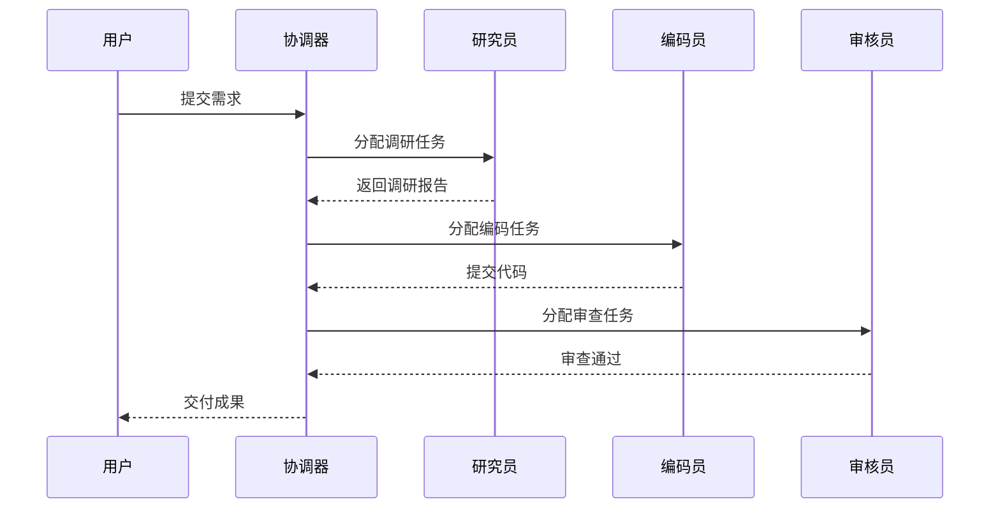
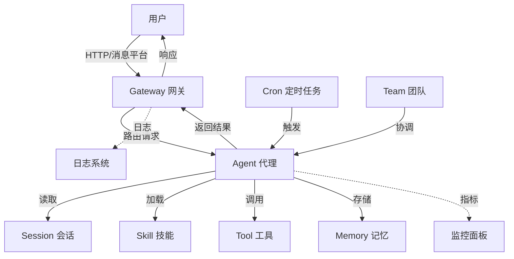
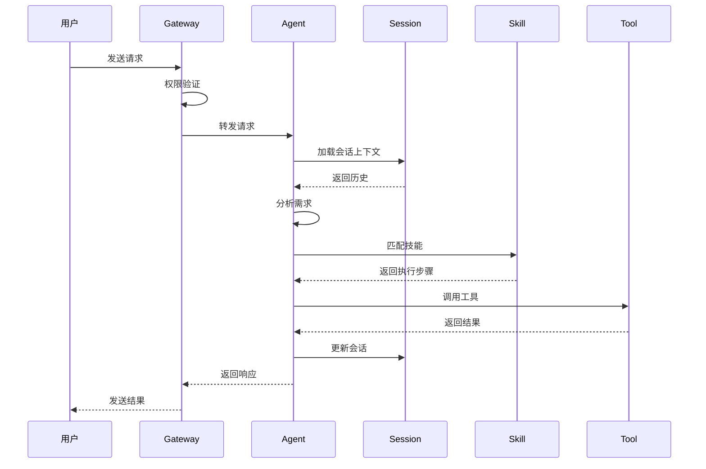

# 📘 OpenClaw 核心概念入门教程

> **培训阶段**：第一阶段 - 安装与基础概念（1 天）
> **目标**：深入理解 Agent、Session、Skill、Cron、Team 的关系和架构数据流
> **预计用时**：1-2 小时

---

## 📋 学习目标

完成本教程后，你将能够：
- ✅ 清晰解释 Agent/Session/Skill/Cron/Team 的关系
- ✅ 画出完整的架构数据流图
- ✅ 理解每个组件的配置位置和生命周期
- ✅ 设计简单的自动化工作流

---

## 🤖 1. Agent（智能代理）

Agent 是 OpenClaw 的核心执行单元——它负责"思考"和"行动"。

**比喻**：像一个员工，有独立的思想、技能和记忆。

### Agent 的核心能力

| 能力 | 说明 | 示例 |
|------|------|------|
| **感知** | 理解用户输入、读取文件、查看环境 | 读取需求文档、查看代码结构 |
| **思考** | 分析问题、制定计划、做出决策 | 设计架构方案、选择技术栈 |
| **执行** | 运行命令、修改文件、调用工具 | 编写代码、执行测试、部署服务 |
| **记忆** | 记住对话历史、用户偏好、项目上下文 | 记住编码风格、项目规范 |

### Agent 的工作模式

| 模式 | 说明 | 适用场景 |
|------|------|---------|
| **Craft** | 直接执行，边做边改 | 简单任务、快速原型 |
| **Plan** | 先制定计划，再按步骤执行 | 复杂项目、架构设计 |
| **Ask** | 只回答问题，不修改文件 | 咨询、学习、代码审查 |

### Agent 的配置位置

```
~/.openclaw/agents/main/
├── agent/
│   ├── models.json      ← 模型配置
│   └── agent.json       ← Agent 行为配置
└── ...
```

### Agent 的生命周期

```
初始化 → 加载配置 → 连接模型 → 等待请求 → 处理任务 → 返回结果 → 更新记忆
```

---

## 💬 2. Session（会话）

Session 是一次完整的对话或任务上下文。

**比喻**：像一次会议记录，包含所有讨论内容和决策。

### Session 的核心特性

| 特性 | 说明 | 示例 |
|------|------|------|
| **独立性** | 每次对话有独立的上下文 | 不同项目不同会话 |
| **持久性** | 可以保持活跃，持续对话 | 长期项目跟进 |
| **隔离性** | 不同渠道不同会话 | Web、终端、消息平台各自独立 |
| **可压缩** | 上下文过长时自动压缩 | 节省 Token，保留关键信息 |

### Session 的类型

| 类型 | 说明 | 使用场景 |
|------|------|---------|
| **Interactive** | 交互式会话，用户实时对话 | 日常聊天、代码编写 |
| **Isolated** | 隔离会话，独立执行任务 | Cron 定时任务、后台处理 |
| **Team** | 团队会话，多 Agent 协作 | 复杂项目、分工合作 |

### 查看和管理会话

```bash
# Web Dashboard 查看所有会话
http://localhost:18789/sessions

# 终端查看活跃会话
openclaw session list

# 清理过期会话
openclaw session clean --older-than 7d
```

### Session 的数据结构

```json
{
  "id": "session-abc123",
  "agent": "main",
  "type": "interactive",
  "created": "2026-04-27T10:00:00Z",
  "messages": [
    {"role": "user", "content": "帮我写个 API"},
    {"role": "assistant", "content": "好的，我来设计..."}
  ],
  "context": {
    "files_read": ["src/api.ts"],
    "tools_used": ["read_file", "write_to_file"],
    "skills_used": ["api-design"]
  }
}
```

---

## 🎯 3. Skill（技能）

Skill 是 Agent 的能力扩展——告诉它"怎么做特定任务"。

**比喻**：像员工的专业培训，掌握特定工作流。

### Skill 的完整结构

```
skills/my-skill/
├── SKILL.md           ← 技能描述（必须）
├── references/        ← 参考资料（可选）
│   └── api-doc.md
├── scripts/           ← 执行脚本（可选）
│   └── run.py
└── assets/            ← 资源文件（可选）
    └── template.json
```

### SKILL.md 的标准格式

```markdown
---
name: my-skill
description: 技能描述
version: 1.0.0
---

# 技能名称

## 触发条件
- 用户提到关键词"XXX"
- 检测到特定文件类型
- 特定命令触发

## 执行步骤
1. 第一步：读取输入
2. 第二步：处理数据
3. 第三步：输出结果

## 注意事项
- 需要 Python 环境
- 依赖 XX 库
- 错误处理方式

## 示例
用户："帮我做 XXX"
Agent：加载 my-skill 技能，执行工作流
```

### Skill 的分类

| 类型 | 位置 | 作用域 | 示例 |
|------|------|--------|------|
| **用户级** | `~/.openclaw/skills/user-level/` | 全局可用 | 网页抓取、数据分析 |
| **项目级** | `{workspace}/.openclaw/skills/project-level/` | 仅当前项目 | 项目特定工作流 |

### Skill 的生命周期

```
发现 → 加载 → 匹配触发 → 执行 → 返回结果 → 记录日志
```

### 管理 Skill

```bash
# 搜索技能
openclaw skills search "关键词"

# 安装技能
openclaw skills install <skill-name>

# 查看已安装
openclaw skills list

# 更新技能
openclaw skills update <skill-name>

# 删除技能
openclaw skills remove <skill-name>

# 刷新技能缓存
openclaw skills refresh
```

---

## ⏰ 4. Cron（定时任务）

Cron 是自动执行的任务——到时间就自动运行。

**比喻**：像一个闹钟 + 自动执行的工作流。

### Cron 的完整配置

```json
{
  "name": "daily-news-summary",
  "schedule": {
    "kind": "cron",
    "expr": "0 8 * * *"  // 每天 8:00
  },
  "payload": {
    "kind": "agentTurn",
    "message": "生成今日新闻摘要"
  },
  "sessionTarget": {
    "kind": "isolated"
  },
  "enabled": true
}
```

### Cron 调度表达式

| 表达式 | 说明 | 示例 |
|--------|------|------|
| `0 8 * * *` | 每天 8:00 | 日报生成 |
| `0 */2 * * *` | 每 2 小时 | 定时监控 |
| `0 9 * * 1-5` | 工作日 9:00 | 工作日提醒 |
| `0 0 1 * *` | 每月 1 号 0:00 | 月度报告 |

### Cron 的 Session 目标

| 类型 | 说明 | 使用场景 |
|------|------|---------|
| **isolated** | 独立会话，不影响其他对话 | 后台任务、定时报告 |
| **current** | 在当前会话执行 | 用户等待的异步任务 |
| **team** | 在团队会话执行 | 多 Agent 协作任务 |

### 管理 Cron 任务

```bash
# 查看所有任务
openclaw cron list

# 创建任务
openclaw cron create --name "daily-report" --schedule "0 8 * * *" --message "生成日报"

# 手动触发
openclaw cron run <task-id>

# 暂停任务
openclaw cron pause <task-id>

# 恢复任务
openclaw cron resume <task-id>

# 删除任务
openclaw cron delete <task-id>

# 查看执行历史
openclaw cron history <task-id>
```

---

## 👥 5. Team（团队协作）⭐ 新增

Team 支持多 Agent 协作——让多个 Agent 分工合作。

**比喻**：像一个项目组，有项目经理、开发工程师、测试工程师等角色。

### Team 的核心概念

| 概念 | 说明 | 示例 |
|------|------|------|
| **角色** | 每个 Agent 有明确职责 | 研究员、编码员、审核员 |
| **消息路由** | Agent 间通信机制 | 任务分配、进度同步 |
| **状态同步** | 共享上下文和进度 | 项目看板、完成状态 |
| **协调器** | 统筹全局的 Agent | 项目经理、调度器 |

### Team 的配置示例

```json
{
  "name": "dev-team",
  "members": [
    {
      "role": "researcher",
      "agent": "research-agent",
      "description": "负责资料收集和整理"
    },
    {
      "role": "coder",
      "agent": "code-agent",
      "description": "负责代码编写和实现"
    },
    {
      "role": "reviewer",
      "agent": "review-agent",
      "description": "负责代码审查和质量检查"
    }
  ],
  "coordinator": "project-manager-agent",
  "communication": {
    "mode": "message-passing",
    "retry": 3,
    "timeout": "30s"
  }
}
```

### Team 协作流程



### 管理 Team

```bash
# 创建团队
openclaw team create dev-team --members researcher,coder,reviewer

# 查看团队列表
openclaw team list

# 查看团队详情
openclaw team show dev-team

# 发送团队消息
openclaw team message dev-team "任务进度更新"

# 停止团队
openclaw team stop dev-team
```

---

## 🌐 6. Gateway（网关）

Gateway 是 OpenClaw 的对外接口——连接各种消息平台和用户。

**比喻**：像公司的前台接待，负责接收请求并路由到正确的部门。

### Gateway 的架构

```
用户请求
  ↓
[消息平台] → 企业微信/飞书/钉钉/Web/终端
  ↓
[Gateway] → 权限验证、日志记录、会话管理
  ↓
[Agent] → 处理请求、执行任务
  ↓
[响应] → 返回结果给用户
```

### Gateway 的配置

```json
{
  "port": 18789,
  "host": "0.0.0.0",
  "cors": true,
  "auth": {
    "enabled": false,
    "token": "your-secret-token"
  },
  "logging": {
    "level": "info",
    "file": "~/.openclaw/gateway/gateway.log"
  }
}
```

### 管理 Gateway

```bash
# 启动网关
openclaw gateway start

# 停止网关
openclaw gateway stop

# 重启网关
openclaw gateway restart

# 查看状态
openclaw gateway status

# 查看日志
tail -f ~/.openclaw/gateway/gateway.log
```

---

## 🔗 核心概念关系图

### 完整架构图



### 数据流时序图



### 实战场景示例

**场景：每日新闻摘要自动化**

```
1. Cron 触发（每天早上 8:00）
   ↓
2. Gateway 接收定时触发请求
   ↓
3. 创建独立 Session（isolated）
   ↓
4. Agent 加载新闻抓取 Skill
   ↓
5. Skill 执行：
   - 调用新闻 API
   - 筛选重要新闻
   - 生成摘要
   ↓
6. Agent 保存结果到文件
   ↓
7. 通过消息平台发送给用户
   ↓
8. Session 结束，记录日志
```

---

## ✅ 考核验证清单

完成以下所有项目，才算理解核心概念：

### 概念理解
- [ ] 能清晰解释 Agent/Session/Skill/Cron/Team 的定义和作用
- [ ] 能画出完整的架构数据流图
- [ ] 能说明各组件的配置位置和生命周期

### 实操能力
- [ ] 能配置和管理 Agent 的工作模式
- [ ] 能查看和管理 Session 列表
- [ ] 能创建、安装、调试自定义 Skill
- [ ] 能配置和管理 Cron 定时任务
- [ ] 能设计简单的多 Agent 协作场景

### 架构设计
- [ ] 能画出数据流时序图
- [ ] 能设计完整的自动化工作流
- [ ] 能说明 Gateway 的路由和权限机制

---

## 🎯 实操练习

### 练习 1：配置 Agent 工作模式（30 分钟）

**目标**：配置并切换 Agent 的 Craft/Plan/Ask 模式。

**步骤**：
1. 启动 OpenClaw
2. 使用 Craft 模式执行简单任务
3. 使用 Plan 模式规划复杂任务
4. 使用 Ask 模式咨询问题

**验收标准**：能熟练切换三种模式并理解各自用途。

---

### 练习 2：管理 Session 会话（30 分钟）

**目标**：查看和管理会话列表。

**步骤**：
1. 查看当前活跃会话
2. 清理过期会话
3. 创建新的独立会话

**验收标准**：能正确管理会话，理解会话类型差异。

---

### 练习 3：创建和管理 Cron 任务（30 分钟）

**目标**：创建定时任务并验证执行。

**步骤**：
1. 创建每日新闻摘要 Cron 任务
2. 手动触发测试
3. 查看执行历史

**验收标准**：Cron 任务配置正确，能正常执行。

---

### 练习 4：设计多 Agent 协作场景（30 分钟）

**目标**：设计简单的多 Agent 协作场景。

**步骤**：
1. 设计研究员 + 编码员 + 审核员团队
2. 配置消息路由
3. 测试协作流程

**验收标准**：多 Agent 协作流程正常，消息传递正确。

---

## ✅ 考核验证清单

| 序号 | 考核点 | 验证方法 | 合格标准 |
|------|--------|---------|---------|
| 1 | 概念理解 | 解释核心概念 | 能清晰说明各组件作用 |
| 2 | 架构图 | 画出架构数据流图 | 图表完整，关系正确 |
| 3 | Agent 配置 | 配置工作模式 | 能切换 Craft/Plan/Ask |
| 4 | Session 管理 | 查看和管理会话 | 能清理过期会话 |
| 5 | Skill 管理 | 创建和调试技能 | 技能能正常触发 |
| 6 | Cron 任务 | 创建定时任务 | 任务能正常执行 |
| 7 | 团队协作 | 设计多 Agent 场景 | 协作流程正常 |

---

## 🔍 常见问题排查

### Q1: Agent 模式切换不生效？

**A:** 检查命令格式：
```bash
# 正确用法
/plan 设计用户认证系统
? 解释这个项目架构
```

---

### Q2: Session 清理后数据丢失？

**A:** 清理前备份重要数据：
```bash
# 导出会话
openclaw session export <session-id>
```

---

### Q3: Cron 任务执行失败？

**A:** 检查配置：
```bash
# 查看任务状态
openclaw cron detail <task-id>

# 查看日志
tail -f ~/.openclaw/gateway/gateway.log
```

---

### Q4: Skill 触发条件不匹配？

**A:** 检查 SKILL.md 触发条件：
```bash
cat ~/.openclaw/skills/<name>/SKILL.md | grep -A 5 "触发条件"
```

---

### Q5: Team 消息路由失败？

**A:** 检查团队配置：
```bash
# 查看团队配置
openclaw team show <team-name>

# 检查消息路由
openclaw team logs <team-name>
```

---

### Q6: Gateway 日志过大？

**A:** 配置日志轮转：
```bash
# 配置 logrotate
echo "~/.openclaw/gateway/gateway.log {
    daily
    rotate 7
    compress
    missingok
}" > /etc/logrotate.d/openclaw
```

---

### Q7: 如何备份配置？

**A:** 定期备份配置目录：
```bash
tar -czf openclaw-backup-$(date +%Y%m%d).tar.gz ~/.openclaw/
```

---

## 📝 培训记录表

| 项目 | 内容 |
|------|------|
| **培训阶段** | 第一阶段：安装与基础概念 |
| **培训模块** | 核心概念入门教程 |
| **培训时长** | 1-2 小时 |
| **培训日期** | ____年____月____日 |
| **培训讲师** | ____________________ |
| **学员姓名** | ____________________ |

### 学习进度记录

| 时间 | 学习内容 | 完成状态 | 讲师签字 |
|------|---------|---------|---------|
| 第 1 小时 | Agent + Session 概念 | ☐ 未完成 ☐ 已完成 | ________ |
| 第 2 小时 | Skill + Cron + Team | ☐ 未完成 ☐ 已完成 | ________ |

### 考核结果

| 考核项 | 得分 | 备注 |
|--------|------|------|
| 实操练习 1 | ____/25 | |
| 实操练习 2 | ____/25 | |
| 实操练习 3 | ____/25 | |
| 实操练习 4 | ____/25 | |
| **总分** | **____/100** | |

### 签字确认

| 角色 | 签字 | 日期 |
|------|------|------|
| 学员 | ____________________ | ____年____月____日 |
| 讲师 | ____________________ | ____年____月____日 |
| 主管 | ____________________ | ____年____月____日 |
